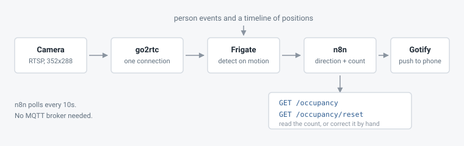
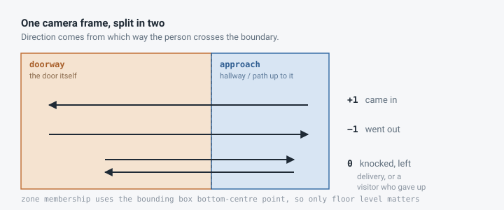
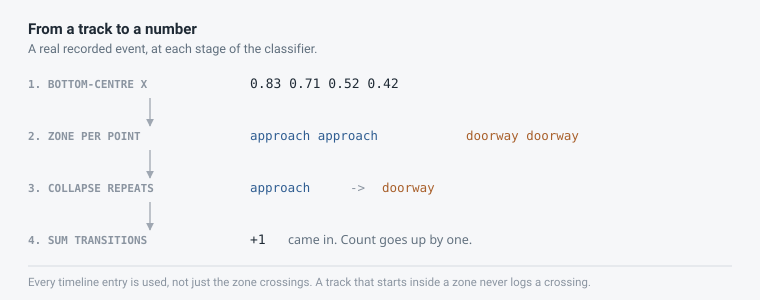

# doorway-occupancy

Counts how many people are home, using one camera pointed at the front door.

Frigate detects a person at the door. What it does not tell you is which way
they were walking, and that is the whole problem if you want a headcount. This
works the direction out from the person's path across the frame, keeps a
running count, and sends a snapshot to my phone.

Every outcome it can report has been checked against real footage, not just
reasoned about.

## What it handles

Walking in scores +1. Walking out scores -1. Someone who walks up, knocks and
leaves nets to zero, so deliveries and visitors do not inflate the count. That
still works when Frigate splits a single visit into two separate events,
because the deltas add up either way.

Zone shapes are read from Frigate's config while it runs, so you can redraw
them without touching the workflow.

## The two zones

The frame is split in two. `doorway` is the floor right at the door, where
someone stands to open it. `approach` is whatever people walk through to get
there. Zone membership uses the bottom-centre of the bounding box, roughly
where the feet are, so only floor level matters.

## Working out direction

n8n polls Frigate for finished events every 10 seconds. For each one it pulls
the timeline, turns every entry into a point, works out which zone that point
sits in, collapses consecutive repeats, then sums the transitions:

    approach -> doorway   = +1
    doorway  -> approach   = -1

The sum is that event's delta.

### Two approaches that do not work

Both of these looked right to me and were only caught by walking past the
camera and checking the answer.

Reading `event.zones` fails. That field records each zone's first entry and
never repeats, so a round trip cannot be represented in it. Walking out and
back reads as a plain exit.

Reading only the `entered_zone` timeline entries fails too. Those fire on a
transition, so a track that starts already inside a zone never logs one, and a
single crossing ends up with one data point and nothing to compare against.

Using every timeline entry fixes both.

## What you need

A camera at the door with an RTSP stream, placed so people are visible walking
up to it and not just standing at the threshold. Docker. Frigate 0.17.x. The
config here runs OpenVINO on an Intel iGPU, but any detector works.

## Setup

    cp frigate/config.yml frigate/config/config.yml

Put your camera credentials in the `go2rtc` block, then bring both stacks up.

    docker compose -f frigate/docker-compose.yml up -d
    docker compose -f gotify/docker-compose.yml up -d

Change the Gotify admin password and create an application to get a push token.

Import `n8n/frontdoor-occupancy.json`. Two things before it runs. Replace
`FRIGATE_LAN_HOST` with an address your phone can reach, so snapshots in the
notifications load. Then create a Query Auth credential called `Gotify Token`,
parameter name `token`, value your application token, and attach it to the push
node.

If n8n runs in a container, host services are at `172.17.0.1`, not
`127.0.0.1`. The workflow already uses that.

## Zones for your door

The coordinates in `frigate/config.yml` are for my camera and will be wrong for
yours. They assume the door is on the left and people approach from the right.

Draw your own in Frigate under Settings, Mask and Zone Editor. The two zones
must not overlap, and together they should cover the whole floor area a person
can stand in. If your camera looks down a hallway instead of across one, split
the frame top and bottom. The logic does not care about orientation, only which
zone is nearer the door.

Then walk in and out a few times and check the deltas come out as +1 and -1.

## Using it

    curl 'http://localhost:5678/webhook/occupancy'

    {
      "occupancy": 3,
      "entered": 4,
      "left": 1,
      "roundTrips": 2,
      "unclear": 0,
      "confidence": 1,
      "lastEvent": {
        "label": "ENTERED",
        "delta": 1,
        "zoneSequence": ["approach", "doorway"]
      }
    }

Correct it when it drifts. Adding `stats=1` also clears the counters behind the
confidence figure.

    curl 'http://localhost:5678/webhook/occupancy/reset?count=3'
    curl 'http://localhost:5678/webhook/occupancy/reset?count=3&stats=1'

A notification looks like this.

    Person at front door
    2026-08-28 00:14:57, entered (+1).
    Zones: approach -> doorway. Estimated occupancy: 3.

## Things that cost me time

`model:` has to be a top level key in Frigate 0.17. Nesting it under the
detector is accepted without complaint and then ignored, so the detector keeps
feeding 320x320 frames into a 300x300 model, crashes on every inference, and
gets restarted by the watchdog about once a minute. The only symptom you see is
`detection_fps` at zero, which looks exactly like an idle camera.

`record.retain` was removed in 0.17. An unknown key does not fail loudly, it
drops Frigate into safe mode, where the API returns an empty camera list and
everything else looks fine.

Frigate rewrites `config.yml` on startup, so what is on disk may not match what
you wrote. Check the live `/api/config` instead.

Most cameras burn a clock into the video. The seconds digit changes every frame
and reads as motion, so detection runs constantly until you mask it. There is a
mask in the config for this.

Updating a workflow through the n8n API does not swap the running instance
straight away. When it does swap, it overwrites the workflow's static data with
whatever was in the payload, so a state change made in that window silently
reverts. Deploy, wait, then touch state.

## Limits

The count drifts upward over time. Someone standing at the door long enough for
the track to end there, knocking or talking, looks the same as someone walking
through it. Someone who only appears in `doorway` and never in `approach` makes
no transition at all and is missed. Two people entering on one door opening
count as one.

None of that is fixable with better zones, because the information is not in
the video. A door camera cannot see a door open. A contact sensor on the door
solves it properly, and an mmWave presence sensor skips the inference entirely.

What this is good for is knowing someone is at the door with a picture, and
having a rough occupancy figure you fix by hand every so often.
